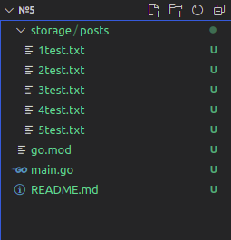

# Файловая система
### Используя код из пункта 4, вместо вывода информации о посте в консоль, создай файл на каждый пост в директориии ./storage/posts в корне проекта и запиши туда содержимое поста с помощью стандартной библиотеки работы с вводом/выводом в файловую систему — ioutil
